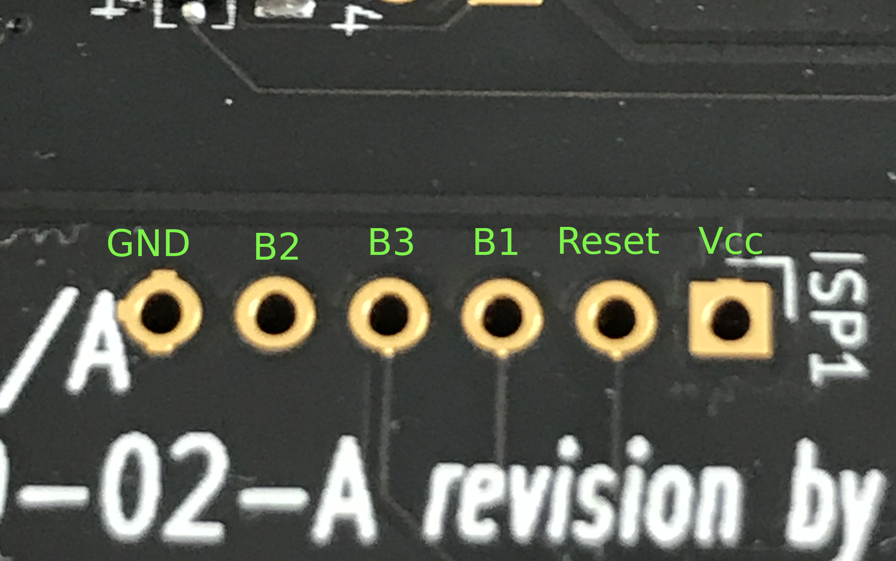
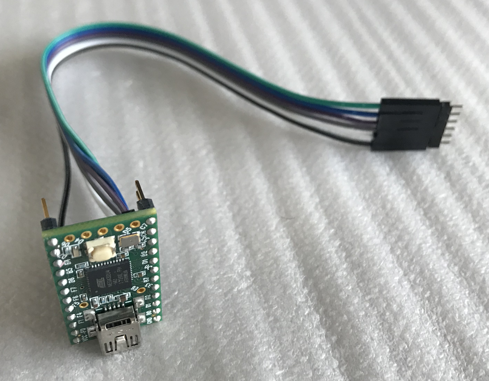
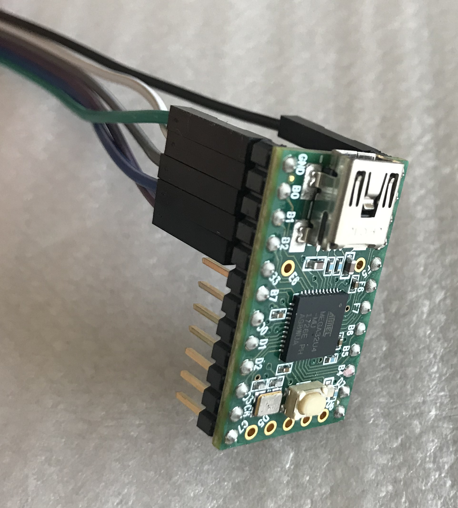
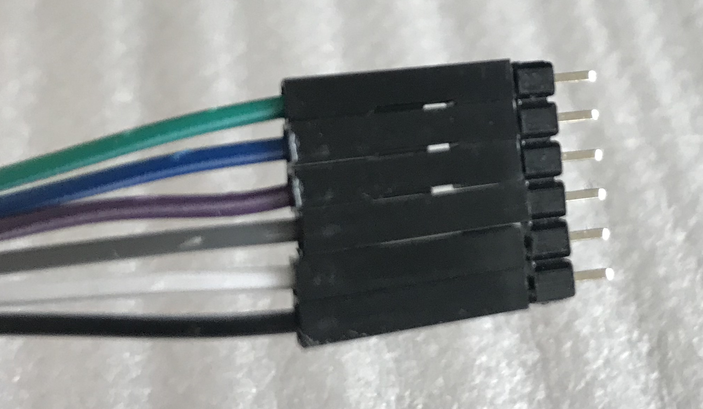
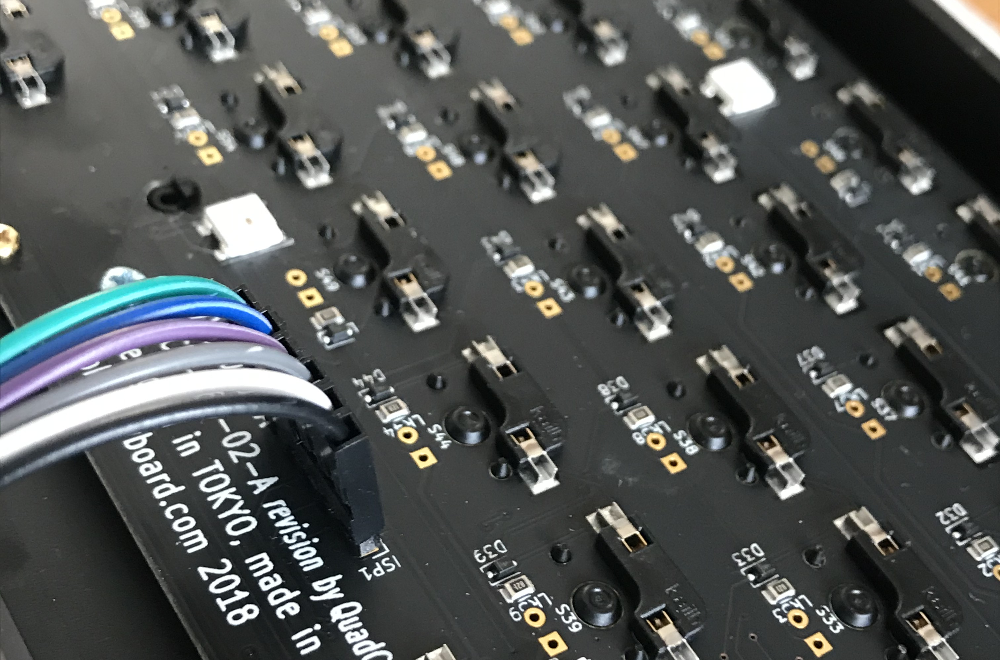
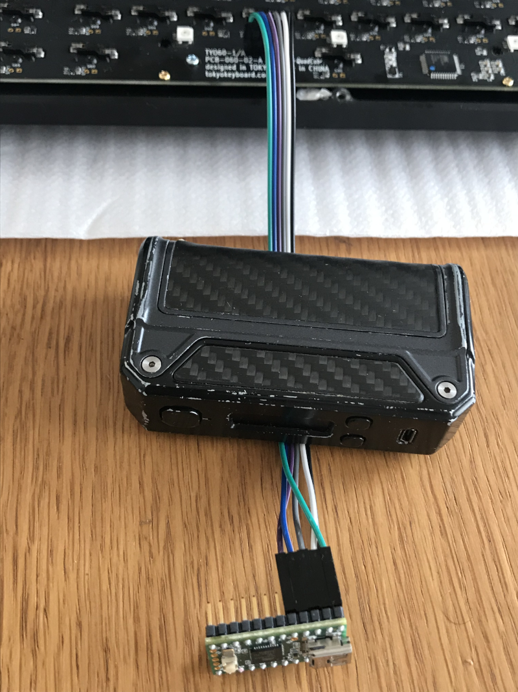
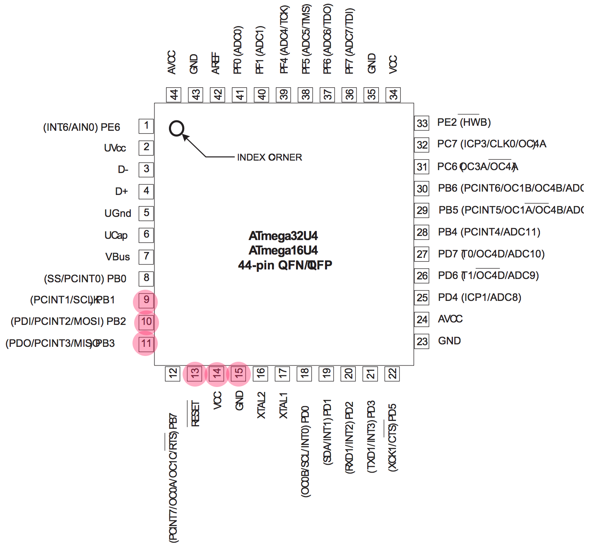
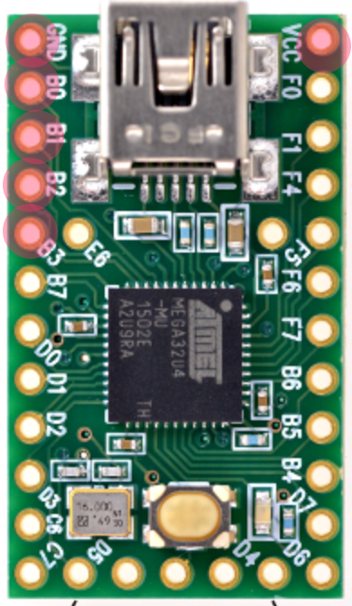
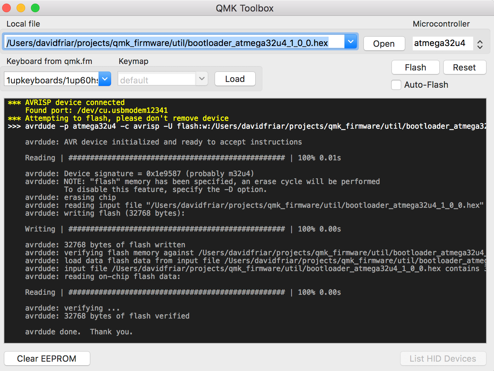
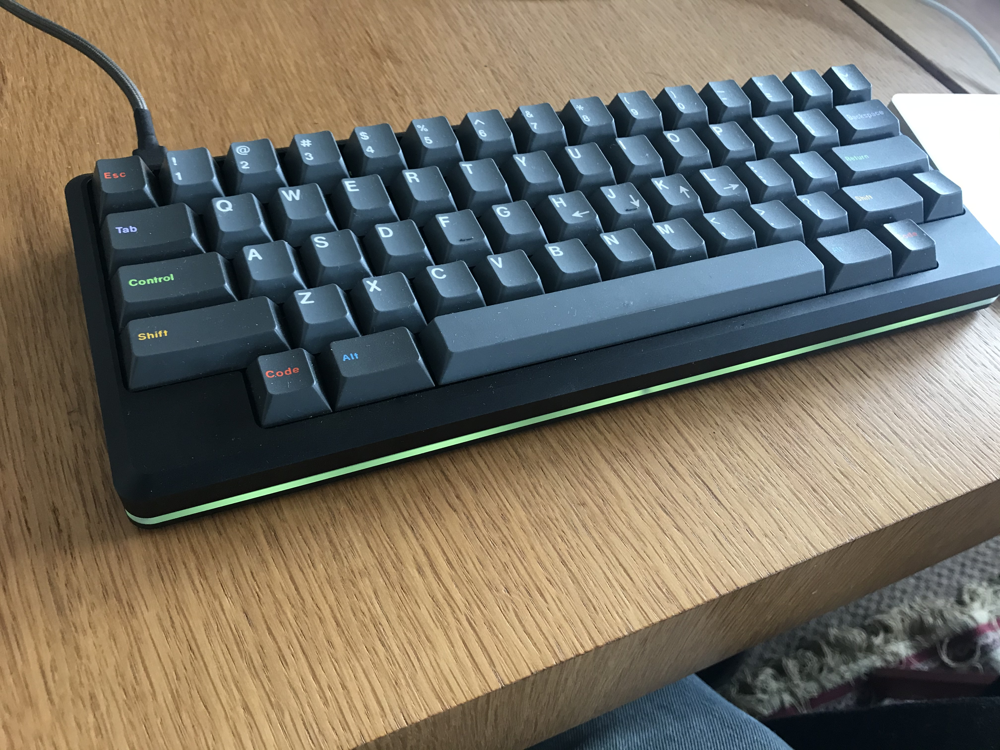

# ISP Flashing the Tokyo60 v3

## What's this all about?
The Tokyo60 is a lovely little 60% mechanical keyboard, with the key feature that it is fully programmable via QMK. Unfortunately there has been an issue with the manufacture of the third version of this keyboard which has resulted in users being unable to use the programming capability.

The normal process of configuring this keyboard is to put it into 'boot mode', either by pressing the reset button on the pcb, or by using a special key combination (LShift + RShift + Fn + P). Once in boot mode the QMK software is used to 'flash' the desired key mappings onto the board, over the USB connection that we normally use to connect the keyboard to the computer. This process depends on a bit of software that runs on the keyboard called a bootloader. In version 3 as delivered the bootloader is either missing or corrupted in some way. The result is that when users attempt to get the board to enter boot mode, nothing happens. The upshot is that it's not possible to reprogram the board in the usual way. As far as we know this problem affects all boards that were sent out as part of the v3 drop. In addition some of the boards were also delivered with the wrong default keymapping (which of course can't be fixed unless we first fix the bootloader problem).

So we need to fix this bootloader, but of course we can't fix it in the normal way by reflashing the board, because we can't flash the board, at least in the normal way. So how does the bootloader get onto the keyboard in the first place? The answer is ISP, or In System Programming. The controller chip on the PCB (an Atmega32u4) allows certain pins on the chip to be used to load code directly into the chip. All we need is a device called an ISP Programmer and a way to connect this to the right pins on the chip on the keyboard PCB.

MassDrop, who are ultimately responsible for the successful delivery of working keyboards from this drop, have assured us that they will ensure that the problem is resolved for everyone. The keyboard designer and the company that manufactured the PCB are working on a fix right now. The problem is that the fix is going to involve manufacturing and sending out some hardware to every customer, and this is inevitably going to take some time.

This guide is for those of us who are impatient, and brave enough to have a go at fixing this ourselves. It turns out that it's possible to make an ISP Programmer with a low cost device like a Teensy 2.0 or a ProMicro and not too difficult to rig it up to re-flash the bootloader.

The information I've captured here comes in a large part from the QMK documentation, in particular from this page: https://beta.docs.qmk.fm/for-makers-and-modders/isp_flashing_guide

## Disclaimer
This isn't an official guide of any kind. It's just a record of what worked for me. **If you follow the steps outlined here, or use any of the information provided, you do so entirely at your own risk.** There's no way to guarantee that it will work for you and that it won't make things worse. If you want to play it safe, then wait for an official solution from MassDrop. That said, it's actually fairly straightforward and the chances of bricking your keyboard irretrievably seem fairly low.

## What will you need?
### Hardware

1. A Teensy 2.0. I got mine here: https://www.amazon.co.uk/gp/product/B01LZ98KUX/ref=ppx_yo_dt_b_asin_title_o01_s00?ie=UTF8&psc=1
1. Some jumper wires: https://www.amazon.co.uk/gp/product/B01EV70C78/ref=ppx_yo_dt_b_asin_image_o01_s00?ie=UTF8&psc=1
1. A strip of male pin header : https://www.amazon.co.uk/gp/product/B01M69EA9O/ref=ppx_yo_dt_b_asin_title_o01_s00?ie=UTF8&psc=1

A ProMicro might be a slightly cheaper alternative to the Teensy. I chose the Teensy because I found one that already had header pins, as I don't have a soldering iron right now.

Note that I'm not a hardware kinda guy. There may well be better or cheaper alternatives to the above, but this is what worked for me.

### Software
1. Teensy Loader : https://www.pjrc.com/teensy/loader.html
1. QMK Toolbox : https://github.com/qmk/qmk_toolbox

I tried using Avrdude as an alternative to QMK Toolbox on my Linux machine but had trouble getting it to work (I suspect this was something to do with the way USB was set up on my machine). In the end I used MacOs and QMK Toolbox.

## Step 1 -- Program the Teensy as an ISP Programmer with Teensy Loader

You need to download the following file and use Teensy Loader to load it onto the Teensy: https://raw.githubusercontent.com/qmk/qmk_firmware/master/util/teensy_2.0_ISP_B0.hex

(You may already have this file locally if you've previously cloned the QMK repo)

## Step 2 -- Wiring
The Tokyo60 has a PCB that makes it relatively convenient to do ISP programming. First, locate the ISP header:

Of course, the key thing is knowing which connection on the Tokyo60 needs to be connected to which connection on the Teensy. A little bit of poking around with a multimeter reveals that the connections on the Tokyo60 end are as shown here:

The connections we need to make need to be like this:

> Teensy B0  <-> Keyboard RESET
>
> Teensy B1  <-> Keyboard B1 (SCLK)
>
> Teensy B2  <-> Keyboard B2 (MOSI)
>
> Teensy B3  <-> Keyboard B3 (MISO)
>
> Teensy VCC <-> Keyboard VCC
>
> Teensy GND <-> Keyboard GND

Notice how every connection simply connects like to like, except that B0 on the Teensy connects to RESET on the Tokyo60.

We're going to make this, in order to connect the Teensy to our keyboard:

We're using female to female jumper wires. These usually come joined together as a ribbon, so just separate a section with six strands (but keep the six joined together as they are easier to connect that way).

On the Teensy end they just plug into the header pins (if we have a Teensy that was supplied with pins attached -- otherwise you'll need to solder a header strip onto the Teensy).

On the end which we're going to connect to the keyboard PCB we can use a section of male header pins. Cut off a section with 6 pins and plug it into our six strand cable like this:

The short ends of our male header strip pins fit nicely into the holes in the PCB like this:

However, the pins don't fit tightly and we're too lazy to solder them so we need to make sure that when we actually do the flashing they are held firmly in contact. You could just hold them in by hand, but I found the best method was to weigh the cable down with something heavy so that the bend in the cable put tension on the connector, like this:

I was a bit paranoid about getting this wiring wrong and frying things that shouldn't be fried. This is where having a multimeter comes in handy. It's a worthwhile exercise, once you have your connections rigged up, to test continuity between each relevant header pin of the Teensy and the relevant leg of the Atmega32u4 chip on the keyboard pcb (see diagrams below with the relevant pins highlighted).

:

## Step 3 -- Flash the bootloader with QMK Toolbox

* Download the bootloader hex file from here : https://raw.githubusercontent.com/qmk/qmk_firmware/master/util/bootloader_atmega32u4_1_0_0.hex

  (You may already have this file locally if you've previously cloned the QMK repo)

* Run QMK Toolbox

* When you plug your Teensy into your computer you should see a message that looks something like this:

* Use the Open button to select the bootloader hex file

* Make sure the Microcontroller selected is atmega32u4

* Say a small prayer

* Press the Flash button

* After a while you should see something like this:

## Step 4 -- Flash your layout as you normally would

If you have got here, then congratulations. Your keyboard will not be working right now, but it should now be possible to reflash it in your normal way using QMK (see https://github.com/JnyJny/tokyo60_keymap/tree/master/firmware). I found that the RSHIFT + LSHIFT + FN + P thing still didn't work but the reset button should now work, and one of the first things I did with my custom map was to add RESET to a key on one of the layers.

## Step 5 -- Bask in the warm glow of satisfaction

Your Tokyo60 is now not just a thing of beauty. Thanks to its infinite programmability, it is also a joy forever.

